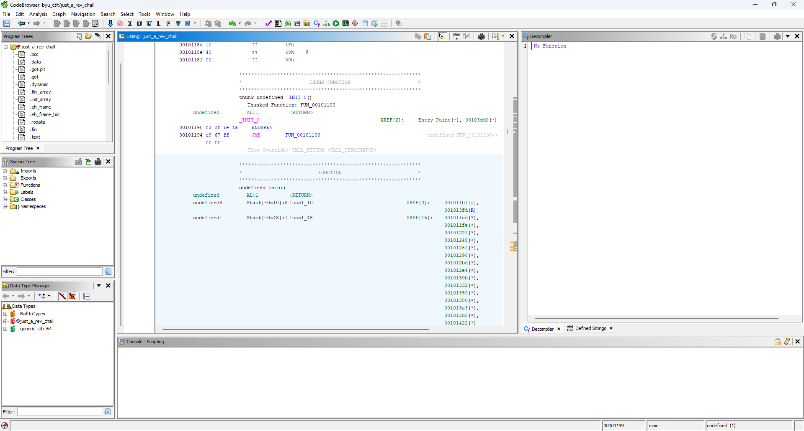
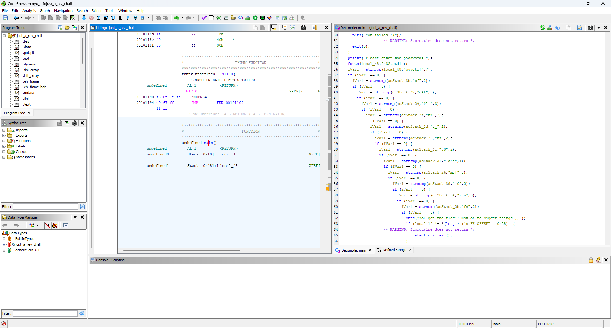

# Solution Steps
First we need to open up just_a_rev_challange in ghidra



Next, by clicking on the main function we can open up the decompiled view of the function



The variables `local_48` and then `acStack` seems to be compared with the input to see if it matches, but we need to put the stack in order so we can figure out the origional string

For this I wrote python code that will find all the acStack variables and sort their associated strings based on the position in the stack

Explanation of the solution python code:
1. Extract the if statements: The if_statements variable contains the copy and pasted code.
2. Regex to Extract Matches: It uses regular expressions to extract the variable names (acStack_XX) and their corresponding string values.
3. Populate the Dictionary: Populates the acStack dictionary with the extracted data.
4. Order the Keys in Reverse: Sorts the keys in reverse order to reconstruct the string.
5. Construct and Print the Result: Constructs the final string and prints it.

# Code
```
import re

if_statements = """
iVar1 = strncmp(local_48,"byuctf{",7);
if (iVar1 == 0) {
  iVar1 = strncmp(acStack_3b,"bf",2);
  if (iVar1 == 0) {
    iVar1 = strncmp(acStack_37,"c4t",3);
    if (iVar1 == 0) {
      iVar1 = strncmp(acStack_29,"0l_",3);
      if (iVar1 == 0) {
        iVar1 = strncmp(acStack_3f,"ur",2);
        if (iVar1 == 0) {
          iVar1 = strncmp(acStack_2d,"t_",2);
          if (iVar1 == 0) {
            iVar1 = strncmp(acStack_39,"us",2);
            if (iVar1 == 0) {
              iVar1 = strncmp(acStack_41,"y0",2);
              if (iVar1 == 0) {
                iVar1 = strncmp(acStack_31,"_c4n",4);
                if (iVar1 == 0) {
                  iVar1 = strncmp(acStack_26,"m3}",3);
                  if (iVar1 == 0) {
                    iVar1 = strncmp(acStack_3d,"_0",2);
                    if (iVar1 == 0) {
                      iVar1 = strncmp(acStack_34,"i0n",3);
                      if (iVar1 == 0) {
                        iVar1 = strncmp(acStack_2b,"f0",2);
"""

# Extract the strings and positions
matches = re.findall(r'strncmp\((acStack_\w+),"(.*?)",', if_statements)

# Initialize variables
local_48 = "byuctf{"
acStack = {}

# Populate the acStack dictionary
for match in matches:
    position, string = match
    position = position.split('_')[1]
    acStack[position] = string

# Order the stack positions
ordered_keys = sorted(acStack.keys(), reverse=True)

# Construct the final string
result = local_48 + ''.join(acStack[key] for key in ordered_keys)

# Print the result
print(result)
```