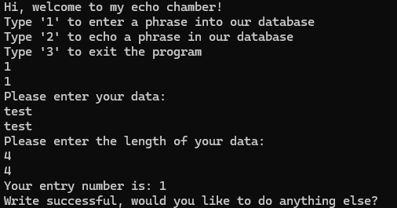
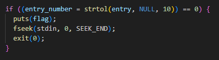
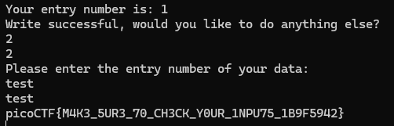

# Solution
Connect to the program with Net Cat
`nc saturn.picoctf.net 57990`

Enter the number 1 to enter data. Enter any data you want and the associated length of that data. 

Within the C code there is a function for writing out the data with this check.

This if-statement gets executed if the program can not read a number from the input

To exploit this we hit option number 2 to print out the data, but instead of passing in the index of the data we pass in any string that we want and the output will be the flag.
