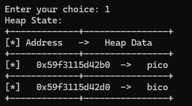

# Solution
Connect to the challange instance using nc
`nc tethys.picoctf.net 56477`

printing the heap we can see the address we can write to is before the "safe_var"

The pico variable to which we can write, is in the position 0x63c3882552b0. The position of the variable to be corrupted is in 0x63c3882552d0. Substracting those two positions gives us 0x20, or 32 in decimal.

That means that we need to write a 33 byte string without spaces, and the flag is ours.

If we write to the buffer 123456789123456789123456789123456 then print the flag we win.