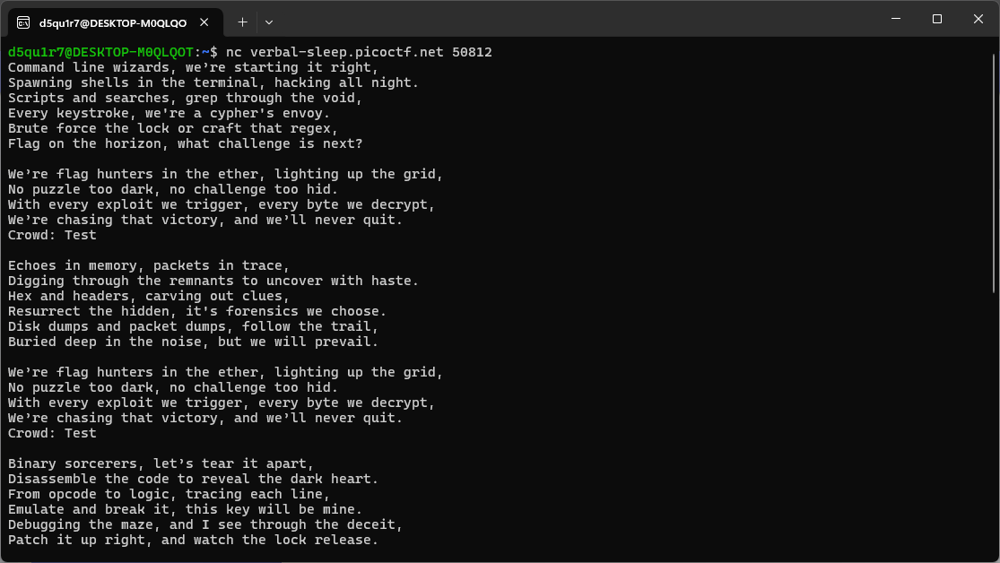
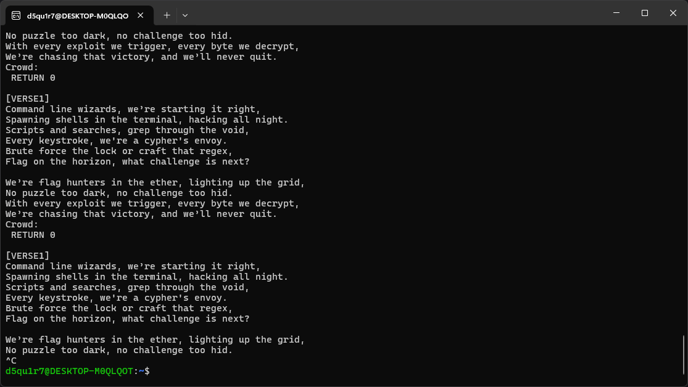
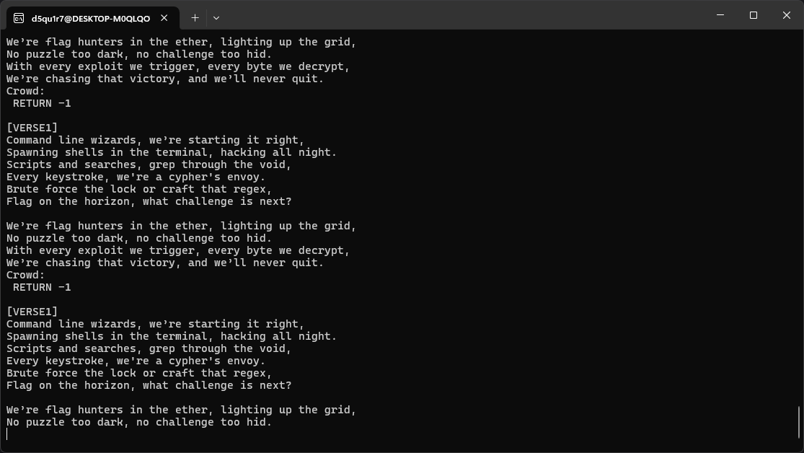
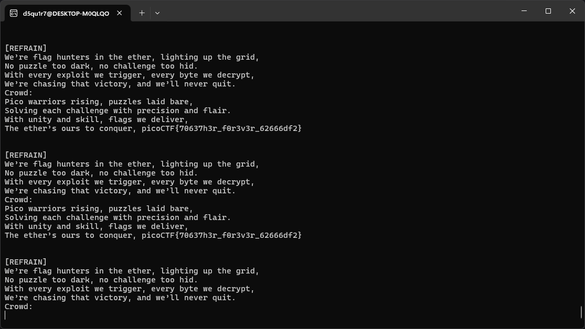

09 July 2025

# picoCTF: Flag Hunters

## Challange Description
Lyrics jump from verses to the refrain kind of like a subroutine call. There's a hidden refrain this program doesn't print by default. Can you get it to print it? There might be something in it for you.
The program's source code can be downloaded here.
Connect to the program with netcat:
```
$ nc verbal-sleep.picoctf.net 50812
```

## Steps to Solve

Looking at this code we can see this secret intro which we need to print out.

```
secret_intro = \
'''Pico warriors rising, puzzles laid bare,
Solving each challenge with precision and flair.
With unity and skill, flags we deliver,
The ether’s ours to conquer, '''\
+ flag + '\n'
```

The program then starts (presumably printing the song) when it hits this `startLabel` variable.

```
for i in range(0, len(song_lines)):
    if song_lines[i] == startLabel:
      start = i + 1
    elif song_lines[i] == '[REFRAIN]':
      refrain = i + 1
    elif song_lines[i] == 'RETURN':
      refrain_return = i
```

The `startLabel` of the program is set to "[VERSE1]".

```
reader(song_flag_hunters, '[VERSE1]')
```

And as we can see by starting the program it starts from verse 1.



We can then see however that after it prints "Crowd" we are able to supply input. That input is then printed whenever the word "REFRAIN" is hit. Let's look at this in the code to see if we can use this to get to the `secret_intro`. Since we can put in whatever string we want let's put in a ";" as that is how the song splits its lines, by doing this we can add in our own line, and that "RETURN" keyword looks good because it allows us to start from anywhere in the song. Trying "; RETURN 0" gives us verse one every time.



Let's try "; RETURN -1".



Dang, that didn't work. However, after a few more attempts I actually ended up mistyping my payload to be ";RETURN 0" instead of "; RETURN 0", and guess what, it worked!



### Working payload
```
;RETURN 0
```

## Flag
```
picoCTF{70637h3r_f0r3v3r_62666df2}
```

## Total Time
- 23 min