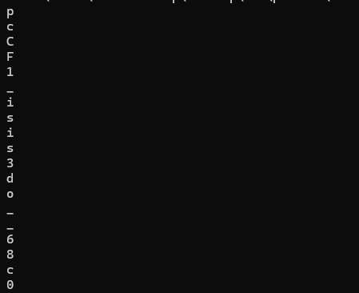

14 September 2025

# picoCTF: Transformation

## Challange Description
I wonder what this really is... enc ''.join([chr((ord(flag[i]) << 8) + ord(flag[i + 1])) for i in range(0, len(flag), 2)])

## Steps to Solve

I first noticed that each set of two characters the first one was shifted over by 8 bits.

```
ord(flag[i]) << 8
```

Normally characters are only stored in 8 bits, so this looked like they were squashing two characters together (similar to doing `FirstcharSecondchar`). To confirm my suspicions I looped through every character and shifted it back 8 bits, then printed it out.



This looked pretty close to a flag, so then I tried for the second letter. All you have to do for the second letter is mask out the top 8 bits to only get the least significant 8. Then putting this all together you get the flag.

## Flag
```
picoCTF{16_bits_inst34d_of_8_26684c20}
```

## Time spent
5 min